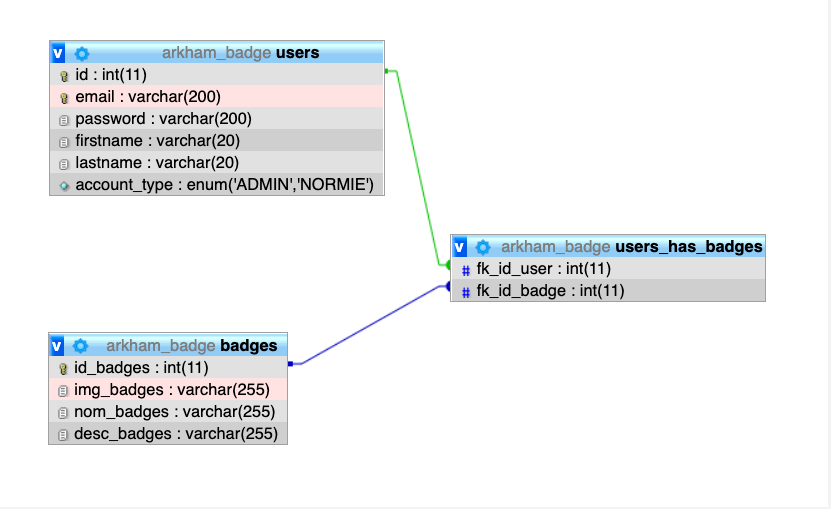

# Badge project
[here](https://sifedinehajji.go.yj.fr/)
# Team Members

- [Ayoube El Yazizi](https://github.com/ayoubelyazizi)
- [Sifedine Hajji](https://github.com/Sifedine-Hajji)
- [Maxime Nef](https://github.com/MaximeNef)
- [Dena Babaie](https://github.com/denababaie)

# Instructions

As part of our training at Becode, we were asked to create a fullstack app dedicated to badge attribution.

## Objectives

Our objectives for this project were to create a fullstack application with a relational database,many-to-many relationships.
We have to create a basic permission system which allows badge administrators as well as users to log in to their account.

With following features included:

- All badges and users listed
- Possibility for administrators to create a badge and grant them to users
- Users having access to their acquired badges
- Administrators being able to add new users in the system
- A stats view for both administrators and users

# Following technologies were used

* HTML
* JS
* CSS
* Bootstrap
* PHP
* SQL

# Management

### Github
We used Github to share our codes and keep track of eachothers work evolution.

### Mockup
We started out by making a mockup of our website in Figma, click [here](https://www.figma.com/proto/IkddLsjnkBUejtnmaTPa5n/Gaming-Arkham?node-id=4%3A688&scaling=scale-down) to view our mockup.

### Database
You can find an image of our database architecture down below.

# Improvement points

* 

# Web Hosting

#### Fair use disclaimer this website is for educational purposes only.
